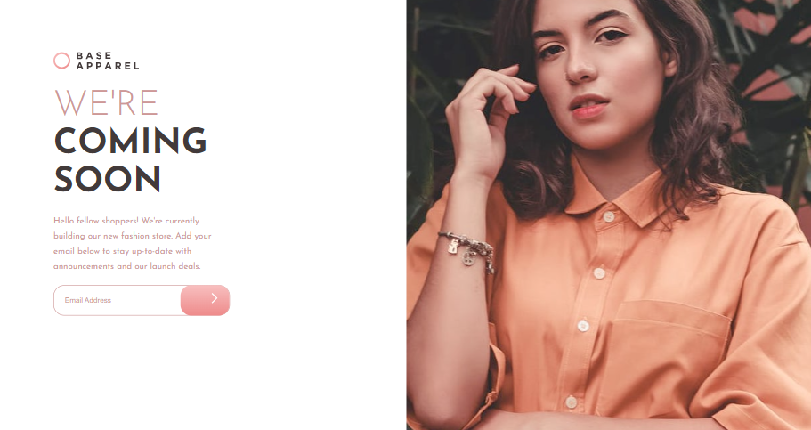

# Title
    Base-Apparel-Coming-Soon

# Preview of the App

# Description
    FrontendMentor Challenge

# Stack used :
    HTML // CSS // JS

## General style :

### Fonts :

- Family: [Josefin Sans](https://fonts.google.com/specimen/Josefin+Sans)

### Colors :

- Desaturated Red: hsl(0, 36%, 70%)
- Soft Red: hsl(0, 93%, 68%)
- Dark Grayish Red: hsl(0, 6%, 24%)
- Linear, 135deg, from hsl(0, 0%, 100%), to hsl(0, 100%, 98%)
- Linear, 135deg, from hsl(0, 80%, 86%), to hsl(0, 74%, 74%)

***
***
***
#### Contact info :

##### oussama Amdouni FrontEnd web-developer

[Portfolio]() | [Linkedin](https://www.linkedin.com/in/usama-amdouni/) | [Github](https://github.com/hernon07) | [Frontend Mentor](https://www.frontendmentor.io/profile/hernon07) | [LeetCode](https://leetcode.com/u/hernon07/)
***
***
***
